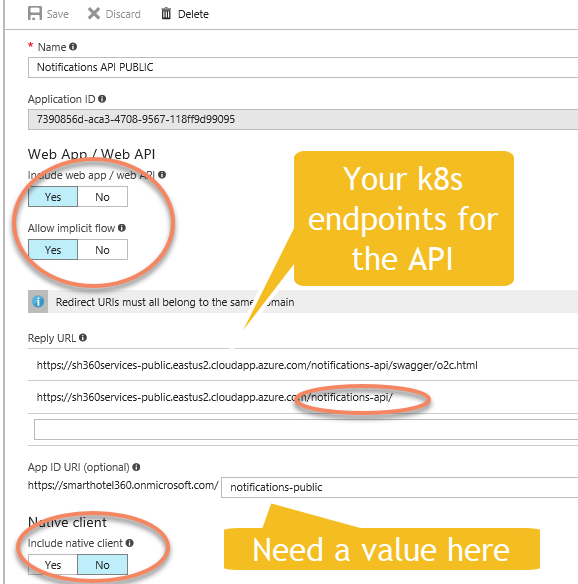
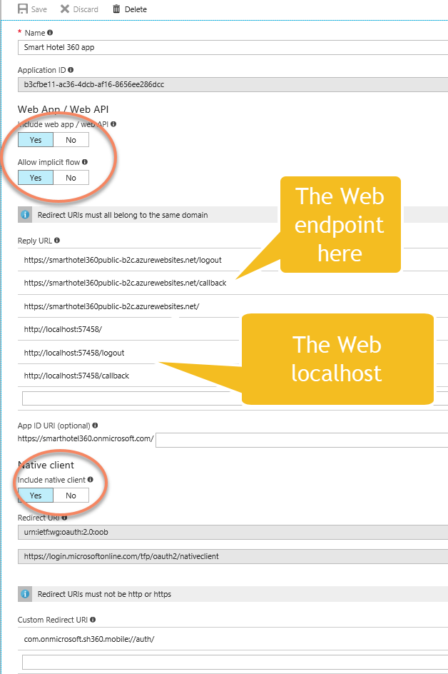
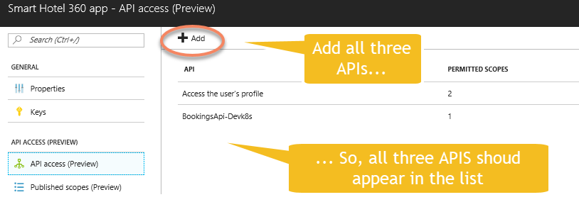

# Deploy services on Azure

> **Note** All tasks must be performed from the `/deploy/k8s` folder. Also you need the [Azure CLI 2.0](https://docs.microsoft.com/en-us/cli/azure/install-azure-cli?view=azure-cli-latest) installed on your system.

## Creating the Kubernetes cluster

The first step is to create the Kubernetes cluster using ACS. For this you must run the `gen-k8s-env.ps1` file from a Powershell window. This script accept various parameters:

* `resourceGroupName`: Resource group name where to deploy the Kubernetes cluster
* `location`: Resource group location
* `registryName` (optional): ACR to create. Only needed if `createAcr` is `$true`.
* `orchestratorName`: Name of the ACS resource
* `dnsName`: DNS name of the main machine of the orchestrator. **This is not the DNS name used to access the services**.
* `createAcr`: If ACR has to be created or not (default value is `$true`)
* `createRg`: If `$true` the resource group is created.
* `agentvmsize`: VM size to use as VM for the cluster
* `agentcount`: How many agents (VMs) will be created (defaults to 1)
* `publicIpName`: Name of the public IP used by the cluster. **This is the IP that will be used to access the services**. If is not passed the public IP is not created.

## Creating all Azure resources

Once the kubernetes cluster is created, you need to create all remaining Azure infrastructure (databases, storages and so on). In the `/deploy/k8s/arm` folder there is one ARM script to create all items. You can use the `deploy.cmd` file to deploy the Azure resources in a new resource group by just typing:

```
deploy azuredeploy <resource-group> -c <location>
```

i.e. to deploy in a resource group called `my-new-rg` and located in `eastus` you can type:

```
deploy azuredeploy my-new-rg -c eastus
```

This will create a set of resources like following ones:


## Deploying services on the K8s cluster

Once Azure resources are created you need to deploy the services on the Kubernetes (k8s) cluster. For this you need to run the `/deploy/k8s/deploy.ps1` script from a Powershell window. This script uses the following parameters:

* `configFile`: Name of the config file to use
* `registry`: Name of the ACR to use. If not passed it assumes images are on DockerHub
* `dockerUser`: ACR or DockerHub user to use (if images are not public)
* `dockerPassword`: ACR or DockerHub password to use (if images are not public)
* `execPath`: Location of `kubectl` tool. Its optional (not needed if `kubectl` is in PATH)
* `kubeconfigPath`: Location of Kubernetes config file. Optional if config file is in their default location.
* `imageTag`: Image tag to use (if not passed assume `latest`)
* `loadBalancerIp`: Public IP to use for the load balancer. If passed **must be the IP (a.b.c.d) of the public IP on Azure**. If not passed a new public IP will be automatically created and assigned.
* `deployCI`: Optional. Do not pass it (is for CI enabled scenarios).
* `useSSL`: Optional. If not passed assumes `$false`. If `$true` the cluster is configured to accept SSL (HTTPS) connections. A SSL certificate is needed.
* `sslCertificate`: Only needs to be set if `useSSL` is `$true`. It is the name of the folder (inside the `nginx-certificates` folder) that contains the SSL certificate
* `deployFrontend`: If `$true` the frontend service (Nginx) is also deployed. If `$false` the frontend is not deployed.
* `buildImages`: If `$true` the images are built (invokes docker-compose build)
* `pushImages`: If `$true` your local images are pushed in the registry
* `dockerOrg`: Name of the organization of your images. Defaults to `smarthotel`.

> **Note**: the files `deploy-full.ps1` and `deploy-no-frontend.ps1` are samples on how deploying all containers in cluster (containing Nginx frontend) and how to update all contaniners except Nginx on a cluster. You need to edit these files to provide your public IP (if desired, if not you can remove the parameter) and disable SSL support if you don't want it.

For example to deploy all services including the NginX frontend you can type:

```.\deploy.ps1 -imageTag public -configFile .\conf_public.yml -loadBalancerIp a.b.c.d -buildImages $false -pushImages $false -deployFrontend $true -useSSL $false``` 

This will deploy all services in the K8s, without SSL support, using the configuration file `conf_public.yml` (a bit on this later), and the public IP of the container to be `a.b.c.d`.
> **Note**: This public IP **must be created before and exists in the same resource group that k8s cluster** (note that `gen-k8s-env.ps1` can create the Azure public IP1.)

Once run you can check everything is installed by typing `kubectl get services`. The answer should be like:

```
NAME            CLUSTER-IP     EXTERNAL-IP    PORT(S)                      AGE
bookings        10.0.72.109    <none>         80/TCP                       18h
config          10.0.159.143   <none>         80/TCP                       18h
discounts       10.0.46.77     <none>         80/TCP                       18h
frontend        10.0.241.34    aa.bb.cc.dd    80:30768/TCP,443:30317/TCP   6d
hotels          10.0.42.187    <none>         80/TCP                       18h
kubernetes      10.0.0.1       <none>         443/TCP                      7d
notifications   10.0.228.103   <none>         80/TCP                       18h
profiles        10.0.229.70    <none>         80/TCP                       18h
reviews         10.0.213.186   <none>         80/TCP                       18h
suggestions     10.0.156.59    <none>         80/TCP                       18h
tasks           10.0.68.136    <none>         80/TCP                       18h
```

Note that the "EXTENRAL-IP" of the "frontend" service is your Azure public IP. If you don't specify public ip (don't use `loadBalanceIp` parameter, a random IP will be created each time).
> **Note**: The EXTERNAL-IP could take some minutes (between 1 and 6 usually) to appear.

### Updating services

If you update a service and want to redeploy the Kubernetes cluster you can proceed as following:

1. Run the `deploy.ps1` script but **don't deploy the frontend again** (use the `-deployFrontend $false` option).
2. Once deployment is completed run the following command in a Poweshell command to delete the frontend pod:

```
kubectl delete pods $(kubectl get pods -o go-template --template @"
{{range .items}}{{.metadata.name}}
{{end}}
"@ | findstr frontend)
```

> **Note** The **multiline is important in the comand**. If you prefer you can also list the pods (`kubectl get pods`) and delete the pod (`kubectl delete pod {podname}`) whose name is "frontend-xxxxx". When the `frontend` pod is deleted, k8s will recreate it automatically.

> **Note** Not all changes require a redeploy on the cluster: if you just change the Docker image you can simply delete all pods. If you change the configuration map you can recreate it and then delete the pods. But if you are unsure, redeploying the services (but not the `frontend` one) and then deleting the `frontend` pod will do the trick.

If you wonder why we don't redeploy the frontend service this is because, Kubernetes requires a free IP on Azure. When the frontend is first created it is tied to the Azure IP specified. But when the frontend service is deleted (what happens if you redeploy the frontend service) the IP is not released (you must do it manually from portal). So, when the frontend service is created again it can't be bound to the IP.~

## Configuration files

The `-configFile` parameter sets the configuration file to configure all the services on the cluster. The `/deploy/k8s/conf_local.yml` is a sample of this configuration file. All entries are mandatory, and you can retrieve its values from the Azure portal.

> **Note**: The AAD B2C values that are in the file are only valid for the services hosted in the public endpoint. You can leave as it if you don't want to use B2C. If you want to use your own B2C you need to update those values.

## Securing the cluster

If you use `-useSSL $true` when deploying in the cluster, support for SSL will be added: the frontend service will be configured to accept SSL connections, but you are required to provide a valid SSL certificate to use. For providing the certificate you have to:

1. Must deploy the certificate (`.crt` file) and the private key (`.key` file) in the `/deploy/k8s/certs-nginx` folder. But files must have the same name and the extensions `.crt` and `.key`.
2. Use the parameter `-sslCertificate [value]` where `[value]` is the name of the files (no extension, just the name)

> **Note**: To create the certificate and the private key files see the file `/deploy/connect_certs/instructions.txt`. **It is strongly suggested to run the commands listed on the file using the WSL** or use a Linux distro. A CA certificate is also provided (you can create your own if you want). Remember you have to install the CA certificate as a "Trusted Root CA" in every client (if not the browser won't accept the cluster certificate). To install the CA certificate on a Windows client run the `/deploy/connect_certs/install_ca.cmd` as an Administrator.

> **Note**: The only reason to secure the cluster is if you want to plan to access it from the web under https. This is required only for Azure B2C. If B2C is not used, you don't have to secure the k8s cluster.

# The configuration service

If you run your own Kubernetes cluster and want to connect the public web and the Xamarin application to it you **need to update the configuration servide** to reflect your new endpoints.

> Note that this prevents you to use the public DockerHub images. You must build the images yourself, and push to your own Docker repository. Remember that `docker-compose build` will build the images without any other requirement.

To do it, open the `/src/SmartHotel.Services.Configuration/cfg` folder and create a new file `myenv.json`. Use the  `localhost-docker.json` file as a template. You need to update:

* The `urls` section with the urls of your services.
* The `pets_config` section (only if you want to recreate the pets demo on local)

## Urls section

When running on Kubernetes all services share the same IP (the public IP created when deploying in the cluster). All services are exposed in `http://<public-ip>` with following paths:

* /hotels-api -> For hotels
* /bookings-api -> For bookings
* /suggestions-api -> For suggestions
* /tasks-api -> For tasks
* /notifications-api -> For notifications
* /reviews-api -> For reviews
* /discounts-api -> For discounts

So, if your public IP is http://a.b.c.d then the endpoint for Hotels API is http://a.b.c.d/hotels-api

> **Note**: Xamarin app do not support https, so must use http if plan to use Xamarin App.

> **Note**: You can create more than one configuration by just creating more files in the `/src/SmartHotel.Services.Configuration/cfg` folder. Then you can go to http://a.b.c.d/configuration-api/cfg to list all configurations and to http://a.b.c.d/configuration-api/cfg/[config] to load the configuration file named `[config.json]`.

Of course once you dropped this file **you must recreate the Docker image of the configuration api** by typing (located in `/src` folder):

```
docker-compose build configuration-api
```

Once the image is rebuilt you have to repush it to the repository and then redeploy the services on the cluster. Finally check the cluster has the updated configuration service by accessing your new configuration endpoint.

# Azure B2C

If you want to use B2C you must create your own B2C and then create applications on it:

* One application for the client (web & Xamarin)
* One application for the hotels api
* One application for the bookings api
* One application for the notifications api

## API applications

All three applications for the APIs share the same config:



Once configured be sure that in the section "Published scopes" of each API application the scope "user_impersonation" is defined (if not, add it yourself):


## Client application

The client application should have a configuration like:



Also in the "API Access" section you need to grant access to the three APIs applications:



With this configuration client app is given access to all three APIs secured by B2C.

> **Note** Remember to update the _configuration file_ (i. e. the `conf_local.yml`) file with the B2C values and redeploy the k8s cluster.
